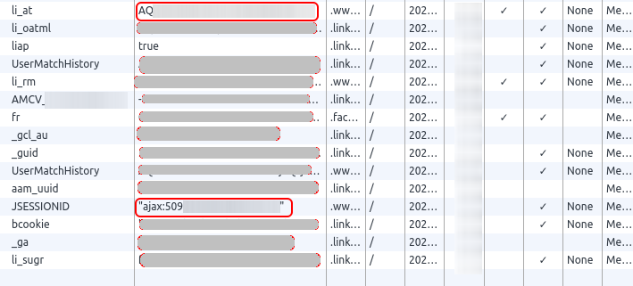

# Nqntnqnqmb
👋 Hi there! For any professional inquiries or collaborations, please reach out to me at:
megadose@protonmail.com

📧 Preferably, use your professional email for correspondence. Let's keep it short and sweet, and all in English!

   
#### For BTC Donations : 1FHDM49QfZX6pJmhjLE5tB2K6CaTLMZpXZ
## Educational purposes only
Allows you to retrieve information on linkedin profiles, companies on linkedin and search on linkedin companies/persons  

## Project example : [Nqntnqnqmb maltego](https://github.com/megadose/nqntnqnqmb-maltego)

# Demo


##  Installation

### With PyPI

```bash
pip3 install nqntnqnqmb
```

### With Github

```bash
git clone https://github.com/megadose/nqntnqnqmb.git
cd nqntnqnqmb/
python3 setup.py install
```

# Usage of nqntnqnqmb.py 
You just have to put the li_at and JSESSIONID cookies in the config.json file. 

If you want to do automatic account rotations, simply add the cookies like this
```json
[{
  "li_at": "1st account",
  "JSESSIONID": "1st account"
},
{
  "li_at": "2nd account",
  "JSESSIONID": "2nd account"
}]
```


```
usage: nqntnqnqmb.py [-h] --mode MODE [--company COMPANY] [--profile PROFILE]
                     [--searchCompany SEARCHCOMPANY]
                     [--searchProfile SEARCHPROFILE] --output OUTPUT

optional arguments:
  -h, --help            show this help message and exit
  --mode MODE           There are different modes: getEmployees to get all
                        employees of a company, getProfileInformations to get
                        all informations on a profile, searchCompany to search
                        a company from the name of the company , searchProfile
                        to search a profile from a name
  --company COMPANY     Url of the company for get all employes (getEmployees)
  --profile PROFILE     Url of the profile for get all informations
                        (getProfileInformations)
  --searchCompany SEARCHCOMPANY
                        The name of the target company (searchCompany)
  --searchProfile SEARCHPROFILE
                        The name of the target (searchProfile)
  --output OUTPUT       Name of the csv output file
```
# Usage of nqntnqnqmb with python:

```python
from nqntnqnqmb import *
getCompanyFromName(company,JSESSIONID,li_at)#Search company on linkedin from name
getProfileFromName(search_string,JSESSIONID,li_at)#Search linkedin profile from name (Simple Usage)
getProfileFromName(search_string,JSESSIONID,li_at,pages_to_scrape=5,results_per_page=20)#Search linkedin profile from name (Advanced Usage)
getCompanyFromProfile(profile_url,JSESSIONID,li_at)#Extract linkedin company from a profile
getAllEmployees(company,JSESSIONID,li_at)#Get all employees of a company from the linkedin company url
getContactInformations(profile_url,JSESSIONID,li_at)#Extract contact informations from a profiles like the email, phone number and more
```

# Thank To :
- [linkedin-scraper](https://github.com/hakimkhalafi/linkedin-scraper)
